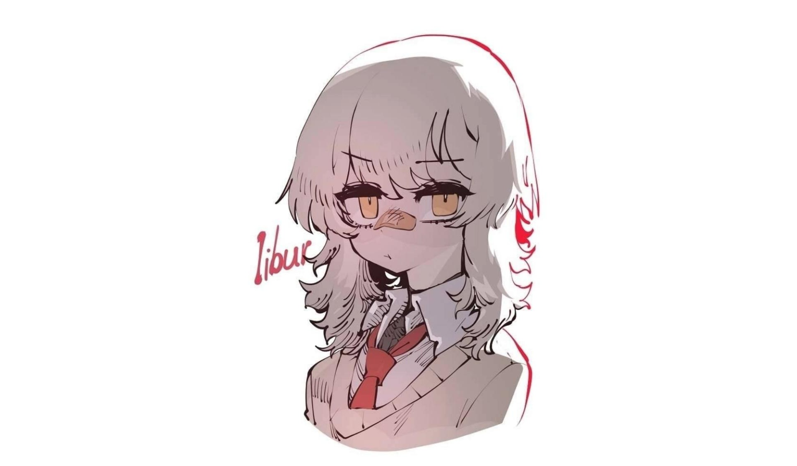

<!-- Cosmic Banner -->

  

<h1 align="left">Welcome, Traveler — I'm <b>Nurasik12</b></h1>

  <i>"Somewhere between the stars and lines of code, I build things..."</i>

---

## About Me

- I explore **AI, ML, mathematics, and engineering**
- Currently working on my Leetcode that mix **DP + algorithms**
- Tech stack: Python, JS/React, C++, ML/DL, CV, NLP, C++  
- I want to build things that stay, inspire, and evolve.

---

## Tech Constellation

  

---

## 🌌 Featured Projects

| 🚀 Project | ⭐ Description |
|-----------|---------------|
| **AuaLine** | Eco-startup that turns smog into printer ink |
| **Lipza – Lip-Reading App** | AI-powered lip-reading learning app for children with hearing impairments |
| **AI Psychotherapist Agent** | Long-term memory AI agent built to provide emotional support and companionship |

---

## 🛸 Connect With Me

  
  
  

---

  
   
  <i>“The universe is expanding… and so am I.”</i>

